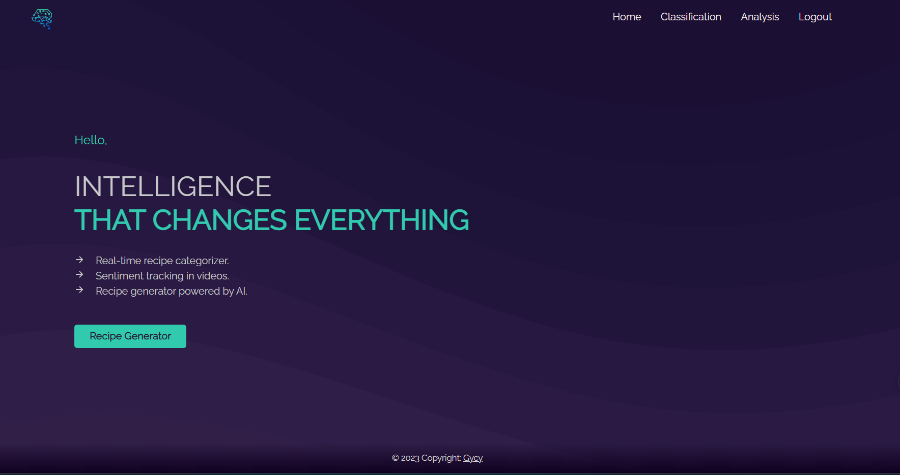

# NutriLog

NutriLog es una página web que ofrece a los usuarios la capacidad de evaluar la salud de las recetas de YouTube mediante la URL de los videos. Además, analiza los comentarios asociados para determinar su sentimiento general. Para una experiencia personalizada, los usuarios registrados pueden crear recetas basadas en ingredientes proporcionados a la inteligencia artificial ChatGPT. La plataforma brinda información valiosa para decisiones informadas sobre la alimentación y promueve la creatividad culinaria. Este proyecto ha sido desarrollado utilizando Angular, Laravel y Flask.

## Características
* **Clasificación de videos recetas:** NutriLog permite a los usuarios ingresar la URL de un video receta de YouTube y, utilizando un algoritmo de clasificación KNN, determina si la receta es saludable, poco saludable o tiene una clasificación intermedia.

* **Evaluación de videos:** analiza los sentimientos de los comentarios asociados al video mediante una URL de video para determinar si estos son positivos o negativos.

* **Interfaz de usuario intuitiva:** La página web cuenta con una interfaz de usuario fácil de usar y atractiva que permite a los usuarios navegar y utilizar las funciones de manera intuitiva. El proceso de evaluación de videos recetas es simple y se proporciona retroalimentación clara sobre los resultados obtenidos.

* **Creación de recetas personalizadas:** Los usuarios registrados en NutriLog tienen la posibilidad de crear sus propias recetas personalizadas. Pueden ingresar los ingredientes deseados y utilizar la IA ChatGPT para obtener sugerencias y recomendaciones relacionadas con la receta.

* **Integración con IA ChatGPT:** NutriLog utiliza una implementación de IA basada en el modelo ChatGPT para proporcionar interacciones con los usuarios y ofrecer sugerencias relacionadas con las recetas creadas. La IA es capaz de comprender y responder a las consultas de los usuarios, brindando una experiencia interactiva y personalizada.

## Tecnologías utilizadas
El proyecto NutriLog se ha desarrollado utilizando las siguientes tecnologías:

* **Angular:** Ha sido utilizado para desarrollar la parte del frontend de la página web, brindando una interfaz de usuario moderna y receptiva.

* **Laravel:** Este framework de desarrollo web en PHP, ha sido utilizado para construir la parte del backend de la aplicación, gestionando la lógica de la comunicación con la base de datos, realizando así las consultas, los registros y los inicios de sesión.

* **Flask:** Python con Flask se ha utilizado para implementar la funcionalidad de la clasificación de los video de recetas de Youtube, así mismo que el análisis de sentimiento de los comentarios.

## Contribución
Agradecemos y valoramos las contribuciones de la comunidad para mejorar NutriLog. Si tienes ideas, sugerencias o encuentras algún problema, no dudes en crear un problema en el repositorio o enviar un pull request.

## Contacto
Si tienes alguna pregunta o sugerencia sobre NutriLog, por favor, no dudes en ponerte en contacto conmigo.

¡Gracias por utilizar NutriLog y por tu interés en la evaluación de recetas saludables!
